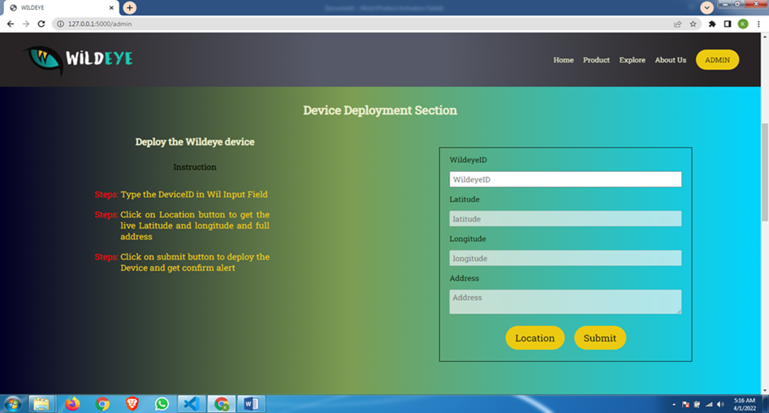
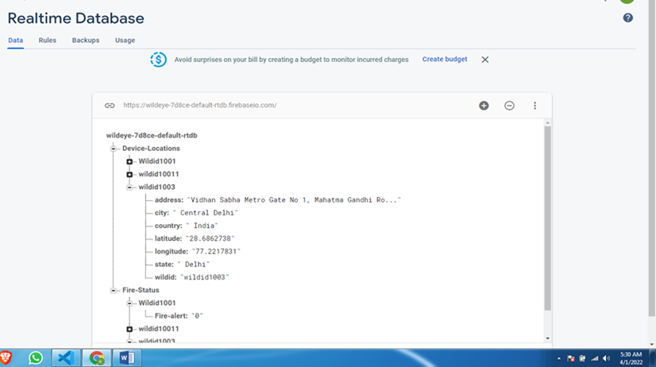
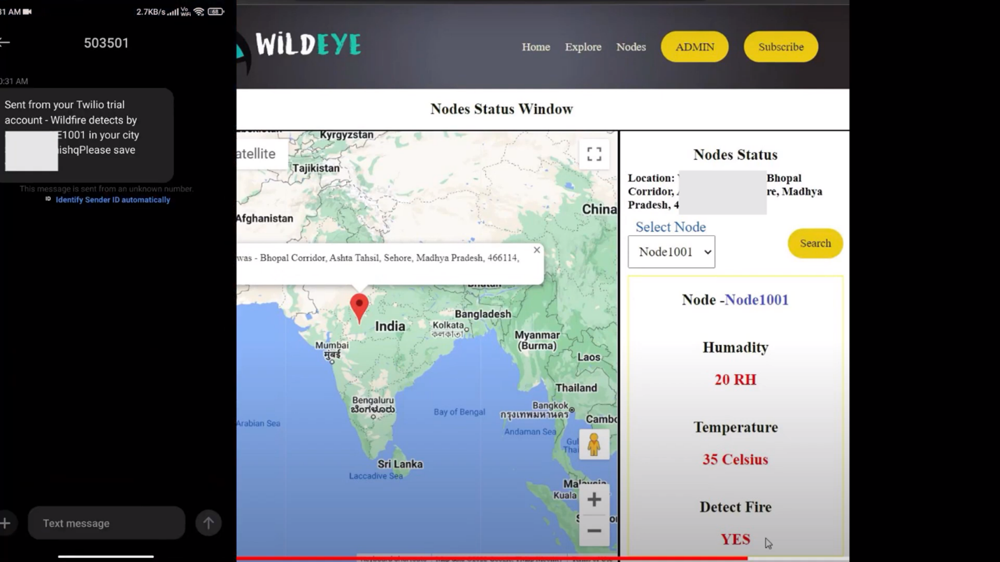

# WildEYE README

## Overview
**Wildeye** is a project designed to monitor wildlife diversity in forests while simultaneously preventing disasters like forest fires by providing real-time alerts to authorities and local communities. This comprehensive solution is made possible through the synergy of three key components.

1. **Hardware**: The project employs a sophisticated hardware setup utilizing the concepts of nodes and gateways. Additionally, ESPcams are utilized to capture images of wildlife in their natural habitat.

2. **Machine Learning**: A crucial aspect of the project involves machine learning. This technology aids in efficiently categorizing the thousands of images captured by Wildeye, enabling the segregation of images based on species.

3. **Web Application**: The project is complemented by a complete web application. This platform enables users from around the world to explore and appreciate the diversity of wildlife in various locations. Simultaneously, it equips authorities with the tools to monitor potential fire alerts and respond swiftly.

The successful fusion of these three components has rendered Wildeye a pioneering project that contributes both to disaster management and the exploration of wildlife diversity.

This project is a web application that utilizes various technologies to create a dynamic and interactive user experience. The technologies used include HTML, CSS, JavaScript, jQuery for AJAX requests, Flask (Python), Firebase (Realtime Database, Firestore, Storage, Cloud Functions), Google Maps API, Axios, and Twilio Messaging API.

## Achievements

- **AWS Deep Learning Challenge 2022**: Wildeye achieved the impressive position of 16 out of 1725 global participants in the AWS Deep Learning Challenge held in March 2022.

- **Google Solution Challenge 2022**: Wildeye secured a place in the top 50 globally in the Google Solution Challenge of 2022.

## Technologies Used

### Frontend
- **HTML**: Used for designing the website's structure.
- **CSS**: Responsible for styling and visual layout.
- **JavaScript**: Provides dynamic features to the website and interacts with various APIs.
- **jQuery**: Utilized for making AJAX requests, enhancing user interactions.
  
### Backend
- **Flask (Python)**: Serves as the backend server to manage communication between Firebase, JavaScript, and the hardware.
  
### Firebase
- **Realtime Database**: Stores and updates information about Gateways, Nodes, and Users.
- **Storage**: Used for storing images of wild animals after being sorted in the cloud.
- **Firestore**: Stores URLs of uploaded images, facilitating sorting and filtering by species in the explore section of the web application.
- **Cloud Functions**: Triggers are set up to respond when nodes' `fire_status` value changes from 0 to 1. Upon triggering, a POST request is generated using Axios to the Flask server's route, which then utilizes Twilio Messaging API to send fire detection messages.
  
### APIs
- **Google Maps API**: Interacts with JavaScript to provide map-related functionalities.
- **Twilio Messaging API**: Sends fire detection messages to residents of the detected fire's city.

## Functionality

The project's main functionalities include:
- Designing the website's structure using HTML and styling it with CSS.
- Using JavaScript for dynamic features, including interacting with Google Maps API and communicating with the Flask server through AJAX requests.
- Utilizing Flask as the server, facilitating communication between Firebase and JavaScript, and handling various routes for data manipulation.
- Employing Firebase's Realtime Database to manage information about Gateways, Nodes, and Users.
- Storing images of wild animals in Firebase Storage after sorting.
- Utilizing Firebase Firestore to store image URLs for easy sorting and filtering by species.
- Implementing Cloud Functions triggers to detect changes in nodes' `fire_status` and notify users via Twilio Messaging API in case of fire detection.

## Website Snapshots

Here are some snapshots of the web application:

   &nbsp; 
    
   &nbsp;
  

   &nbsp;
    
   &nbsp;
  

  <em>1.HOME 2. Node and Gateway deployement section 3. Firebase realtime database 4. Image upload Section 5. Firestore 6. Storage 7. Explore page 8.Fire alert Dashboard</em>

## Credits

This project was developed by Kamal Soni and Tanishq jaiswal and Mukul Agrawal, inspired by the need for efficient fire detection and wildlife monitoring using modern technologies.
  
## Contact

Feel free to reach out to webdevKamal@gmail.com for any questions or inquiries.
